# river_bod
Analysis of public data of river organic pollution in South Korea

## Missing values

  1. Proportion of missing data 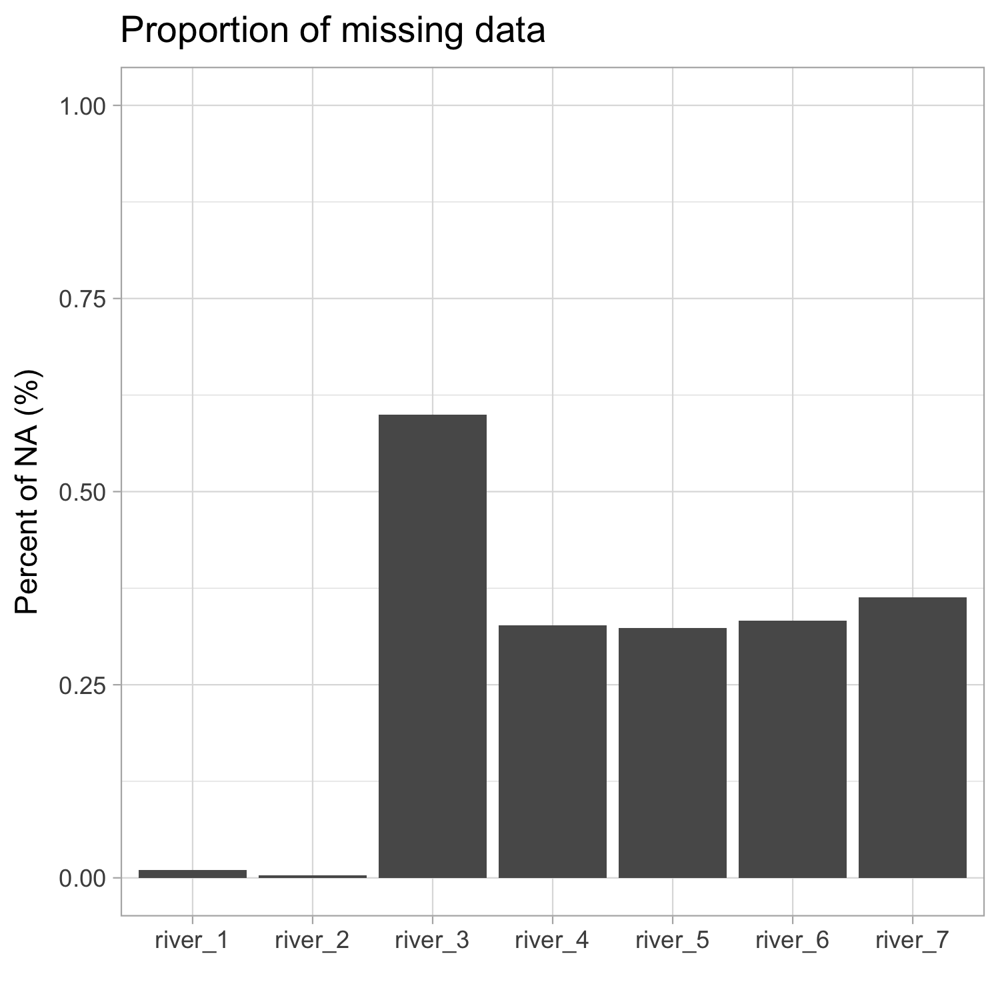  
  2. Total percent of missing data 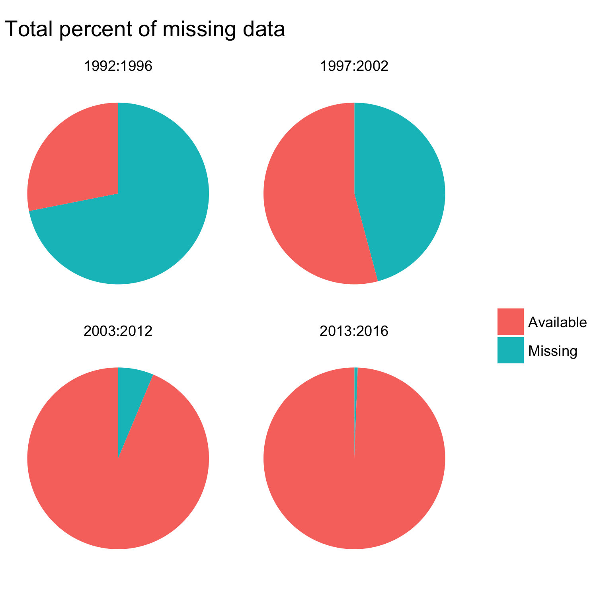  

## Distributions

  3. Distribution of BOD measurements 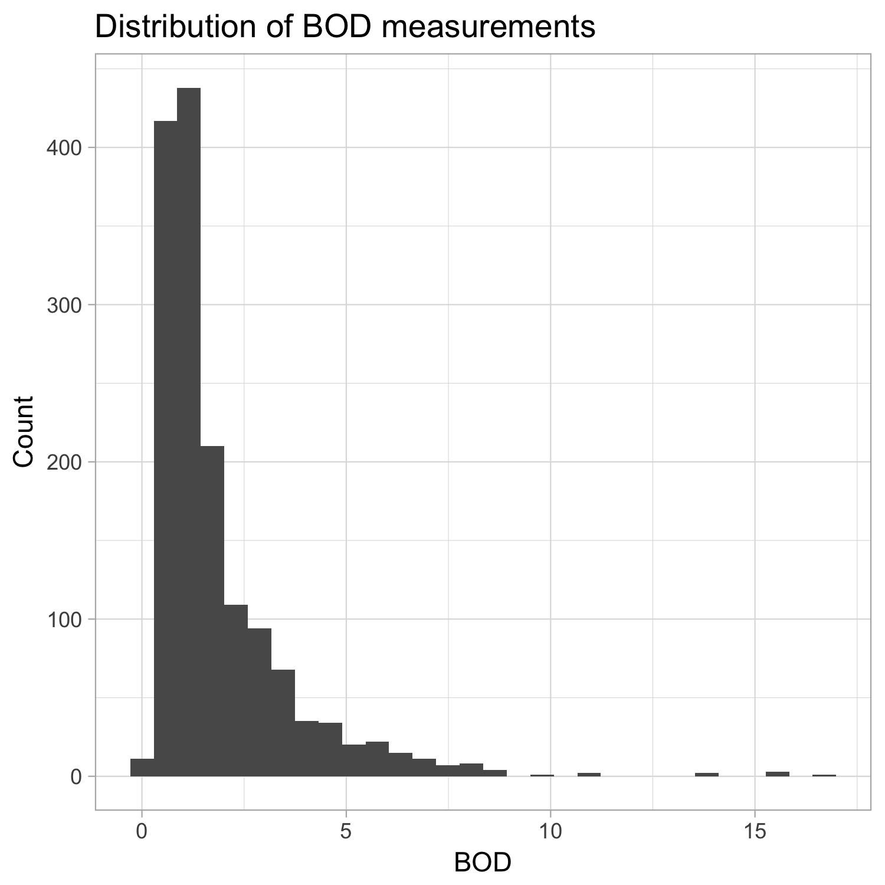  
  4. Distribution of log BOD measurements 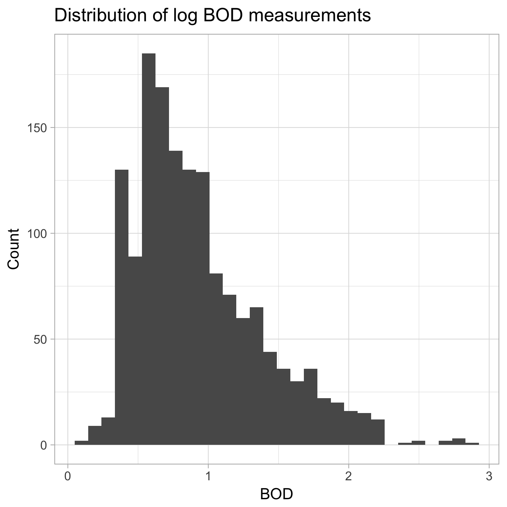  
  5. Distribution of BOD per river 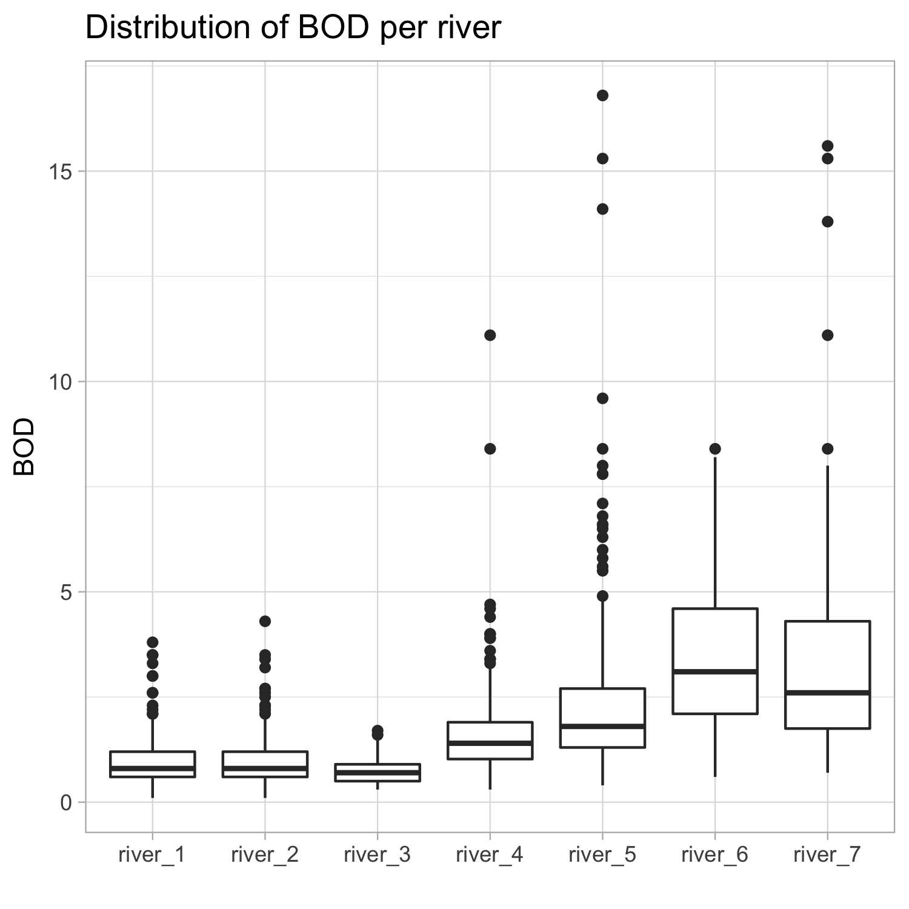  
  6. Distribution of log BOD per river 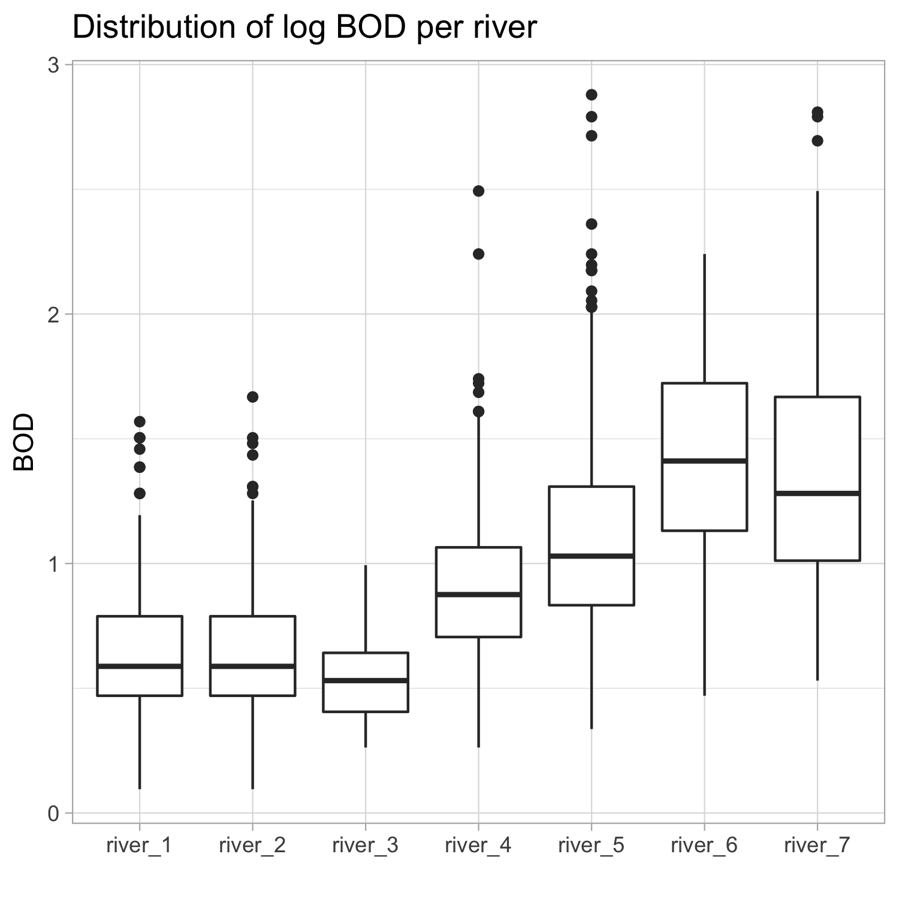  
  7. Distribution of BOD per river over time 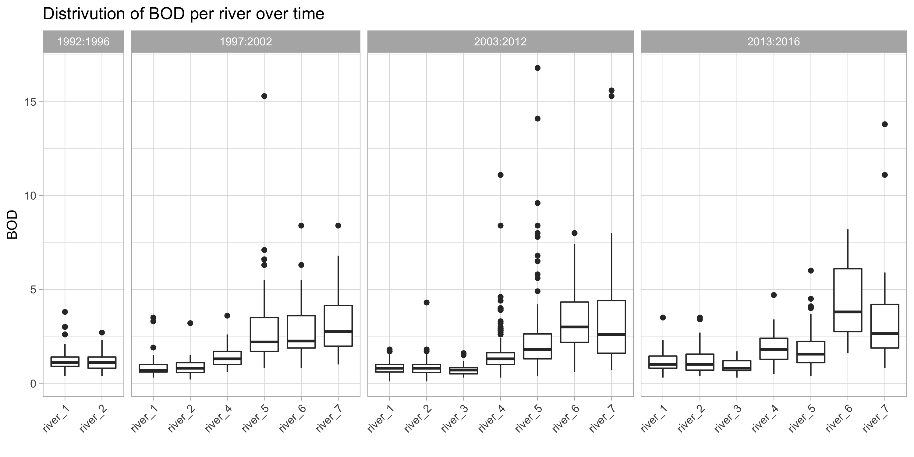  
  
## Trends  

  8. Average BOD over time 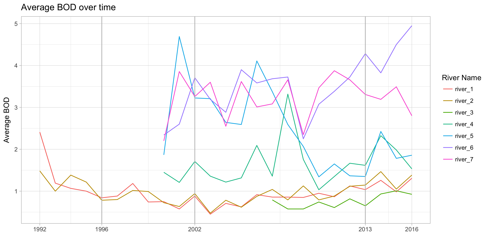  
  9. Average BOD over time (LOESS smoothed) 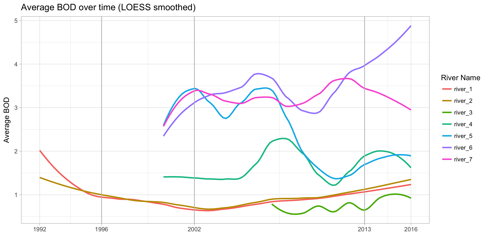  
  10. Contribution of rivers to the total BOD 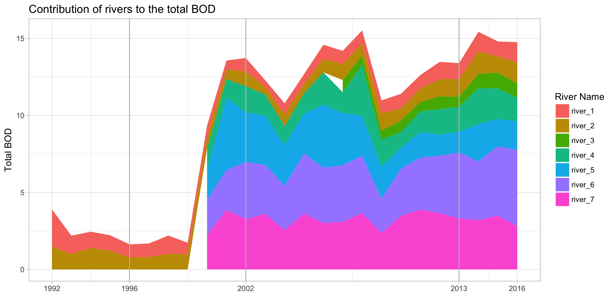  
  11. Average BOD per month 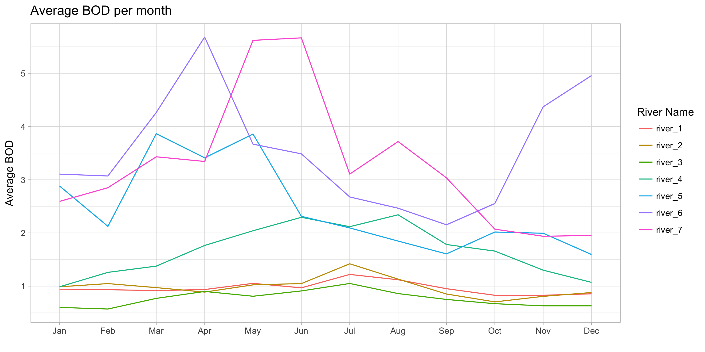  
  12. Average BOD per month (LOESS smoothed) 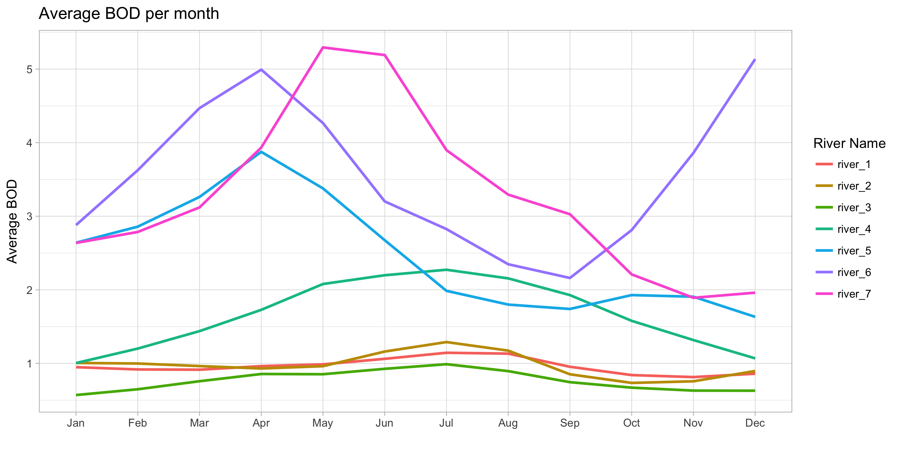  
  
## Maps

  13. Scores and categories map 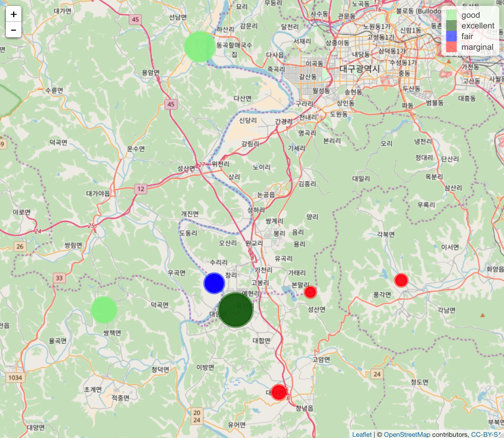  
